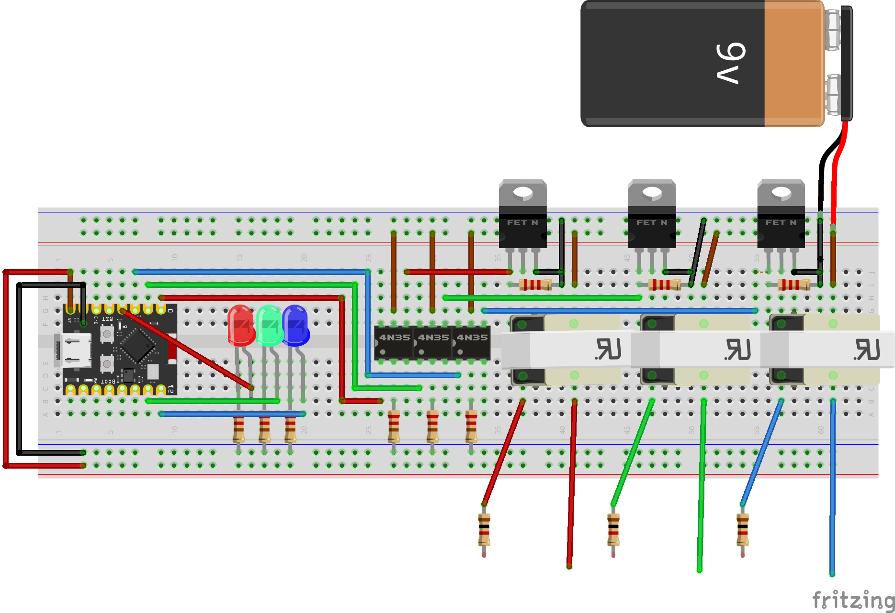

YOU ARE USING THIS DEVICE AT YOUR OWN RISK, HIH VOLTAGES ARE DANGEROUS
I TAKE NO RESPONSIBILITY FOR ANYTHING THAT HAPPENS TO YOU.

# DESCRIPTION
Time to get electrocuted !
BzztMachen shocks you with high voltage square wave every time you take damage in game.
For this to work you'll need:
[BzztMachen Software](https://github.com/Dankeatermidir/bzztmachen)
[BzztMachen Hardware](https://github.com/Dankeatermidir/BzztMachenHardware)
[BzztMachen Tables](https://github.com/Dankeatermidir/BzztTables) for [Cheat engine](https://github.com/cheat-engine/cheat-engine), or make yourself a plugin idk

This repository is a guide on how to make your own BzztMachen.
once again:
# YOU ARE DOING IT AT YOUR OWN RISK

# Schematic

Construction is super easy, just couple of transformes switched with mosfets. It's best to use with two different power sources, this way your microcontroller will be totally isolated from high voltage part, especially that at lower frequencies there are reverse voltage spikes (it's a feature). Values on schematic are just examples, you can make it work in many variations.

### Components

50Hz transformers:
ferrite core phone charger transformers are no use! I might make version using ferrite core transformers and AM modulation, but It's incompatible with this project.
You'll need 50Hz transformers with rated for about 5W. I'm using 220 to 12V Transformes, but you can use different values, just adjust power supply voltage.

Mosfets:
Any N-Channel power FET's should work, but check if gate threshold voltage is lower then power supply voltage.

Optocouplers:
Again any optocouples should work. Check if they can switch with frequency of at least 1kHz.

Resistors:
1/4W resistors are enough. Values don't have to be exact in any means. 200 Om resistors can be in fact between 150-300 Om to work, those 2.2k should work from 200 Om to 20kOm. 1k resistors at output are just in case there is path of too low resistance between electrodes (eg. short circuit). 

Electrodes
For electrodes you should use corrosive resistant material like copper or brass. Optimal distance between electrodes is 2-3cm. Less may cause current flow through sweat instead of skin, and more could cause muscle contraption, whis is obviously unwanted. You should make electrodes detachable from cable so there is no need to re-tape them every tame you go away.

Also It's a good idea to add a fuse so in case of electrical failure you won't fry your transormers which are the most expensive part of this build.

# How to build
Comming soon
